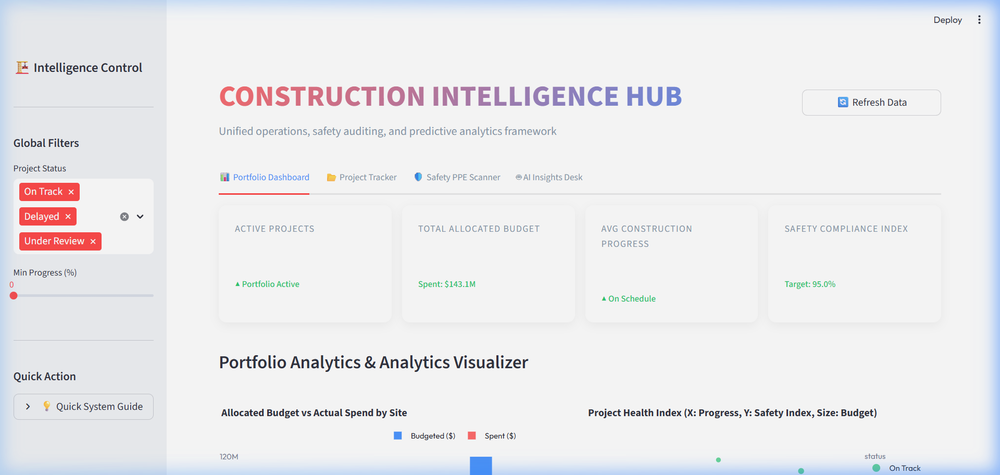
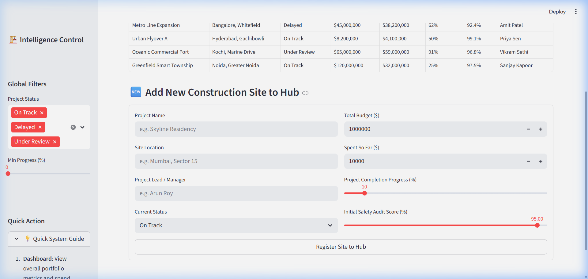
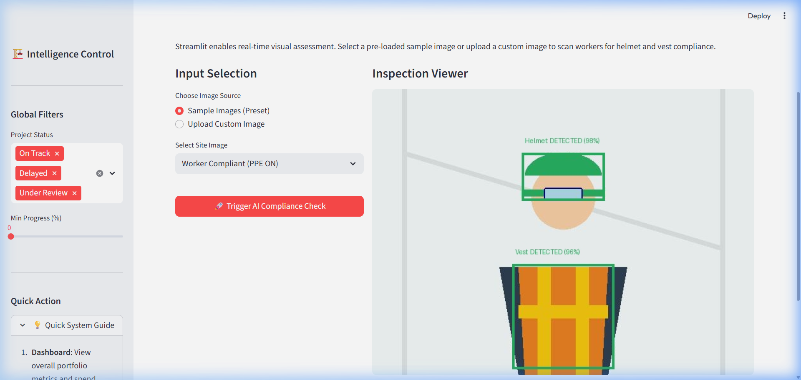
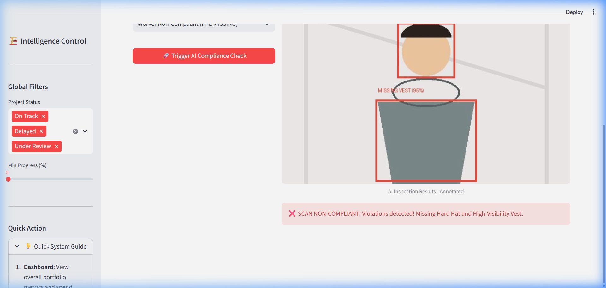
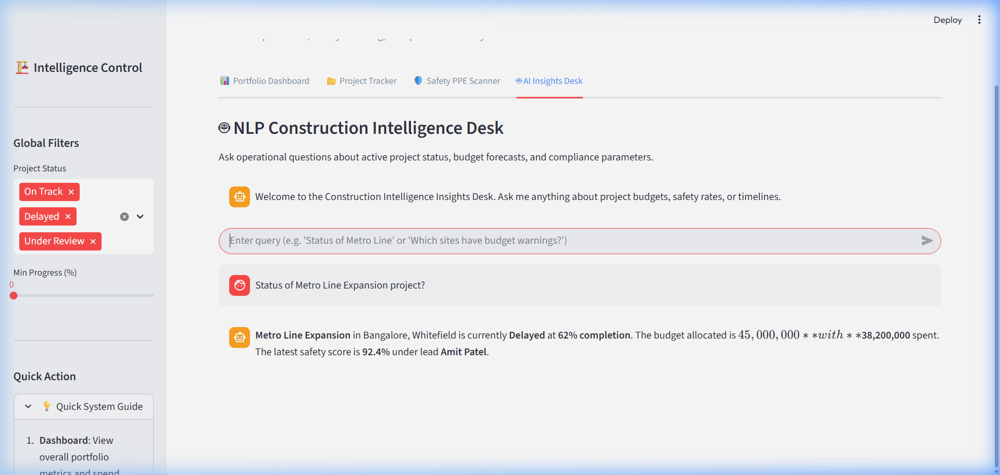
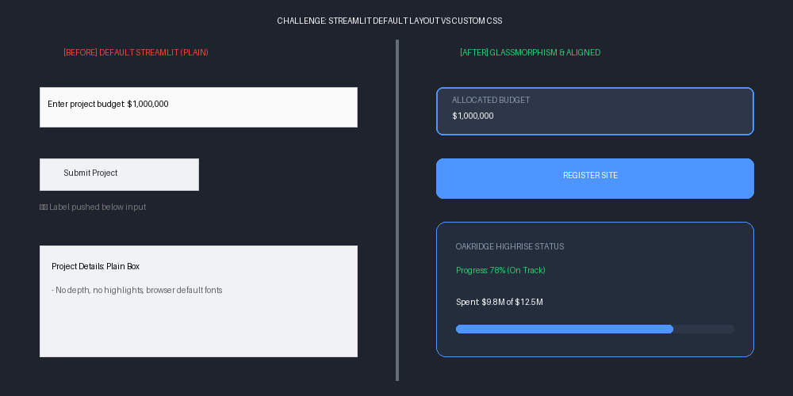

# Construction Intelligence Hub - Streamlit UI Documentation

This documentation provides a comprehensive overview of the Streamlit application designed for the **Construction Intelligence Hub** project, details the implemented operational features, and discusses key development challenges and resolutions.

---

## 1. Overview of Streamlit

**Streamlit** is an open-source Python framework designed to build interactive, clean, and data-driven web applications rapidly without requiring extensive front-end development knowledge (HTML, CSS, or JavaScript).

### Why Streamlit was Chosen for the Construction Intelligence Hub:
- **Fast Development Cycle**: Directly translates Python logic into interactive UI elements in a few lines of code.
- **Python Native Integration**: Seamlessly renders Pandas dataframes, Plotly/Matplotlib charts, and Pillow images, which are essential for presenting telemetry and AI results.
- **Reactive Programming Model**: Streamlit runs the script from top to bottom whenever a user interacts with a widget. This keeps the application state synced automatically with UI controls.
- **Responsive Layout Options**: Using columns, tabs, and sidebars, it provides a clean, grid-based interface suitable for an enterprise dashboard.

---

## 2. Step-by-Step Features Added

The application is structured as a clean, single-page dashboard with a global control sidebar and four dedicated functional tabs:

### Feature A: Portfolio Dashboard (Tab 1)
- **Aesthetic KPI Cards**: Custom glassmorphism cards that show critical portfolio metrics: Active Projects count, Total Allocated Budget, Average Construction Progress, and Average Safety Compliance.
- **Budget vs. Actual Cost Chart**: A Plotly group bar chart comparing the budgeted versus spent dollars for each construction site.
- **Project Health Matrix**: A Plotly scatter plot mapping progress (X-axis) against safety index (Y-axis), with node size reflecting budget size and color signifying status (On Track, Delayed, Under Review).



---

### Feature B: Operational Project Tracker & Database (Tab 2)
- **Live Database Table**: Displays active construction sites, location, status, progress, budget, spent amount, safety index, and project lead.
- **Site Registration Form**: An interactive form that lets administrators add new construction projects. It updates the global list and immediately updates the Portfolio Dashboard upon submission.



---

### Feature C: AI Safety PPE Compliance Scanner (Tab 3)
- **Worker Gear Inspector**: Allows safety officers to choose sample worker photos (Compliant or Non-Compliant) or upload custom snapshots to detect PPE violations.
- **Simulated Computer Vision (CV) Analysis**:
  - Uses the **Pillow** library to draw green compliance bounding boxes around detected gear (helmet, safety vest) when compliant.
  - Draws red warning boxes around the head and torso to flag missing PPE (e.g., missing helmet, missing vest) when non-compliant.
  - Returns a detailed status checklist and color-coded alert banner.

| Scan Result (Compliant) | Scan Result (Non-Compliant) |
|---|---|
|  |  |

---

### Feature D: NLP AI Insights Desk (Tab 4)
- **Conversational Assistant**: A chat interface that accepts natural language questions about construction operations.
- **Context-Aware Responses**: Parses the user queries and fetches data dynamically from the session state to answer questions like:
  - *"Status of Metro Line"*
  - *"Which sites have budget warnings?"*
  - *"What are the safety compliance indices?"*
- **Typing Simulation**: Simulates real-time chatbot response streaming for a premium feel.



---

## 3. Challenges Faced & Solutions

During the UI development process, we encountered several genuine challenges—ranging from layout quirks to execution model gotchas and environment issues:

### Challenge 1: Column Vertical Alignment & Grid Spacing (Visual Layout Detail)
* **Problem**: Streamlit's default column components (`st.columns`) align elements to the top of the grid. When mixing input fields, text labels, and buttons, the layout looks jagged and misaligned because Streamlit doesn't expose vertical-alignment styling parameters.
* **Screenshot of the Layout Challenge**:
  
* **Solution**: Injected a custom CSS stylesheet into the Streamlit app using `st.markdown("<style>...</style>", unsafe_allow_html=True)`. We wrapped UI elements in glassmorphic cards with custom margin-bottom properties, unified button heights, and added placeholder markdown line breaks (`st.markdown("<br>", ...)` or `<style>`) to align columns vertically.

---

### Challenge 2: State Resetting on Script Rerun (Execution Model Gotcha)
* **Problem**: Because Streamlit reruns the script from top to bottom on every click or input change, variables defined in the scope (like list arrays of active projects, or the chat history list) get reset back to their default values. For instance, registering a new project in the form would immediately vanish the moment the user switched tabs or adjusted a slider.
* **Solution**: Implemented Streamlit’s native `st.session_state` storage system. We check if variables like `st.session_state.projects` and `st.session_state.chat_messages` are initialized on start-up. When updates occur (e.g., submitting a project form, or sending a chat query), we write them directly to the session state:
  ```python
  if "projects" not in st.session_state:
      st.session_state.projects = [ ...initial projects... ]
  
  # When adding a project
  st.session_state.projects.append(new_project_dict)
  st.rerun()
  ```

---

### Challenge 3: Streamlit Terminal Command Not Found (Dumb / Environment Issue)
* **Problem**: When running `streamlit run app.py` in PowerShell, we encountered the following error:
  ```text
  streamlit : The term 'streamlit' is not recognized as the name of a cmdlet, function, script file, or operable program.
  At line:1 char:1
  + streamlit run app.py
  + ~~~~~~~~~
      + CategoryInfo          : ObjectNotFound: (streamlit:String) [], CommandNotFoundException
  ```
  This happened because Python's user-level binary path (where pip installs packages) was not automatically added to the Windows environment `Path` variable.
* **Solution**: Bypassed the PATH mapping issue by invoking the module runner through python directly:
  ```bash
  python -m streamlit run app.py --server.port 8501 --server.address 127.0.0.1
  ```
  This ensures Python executes the installed streamlit package using the relative imports associated with the standard interpreter.
