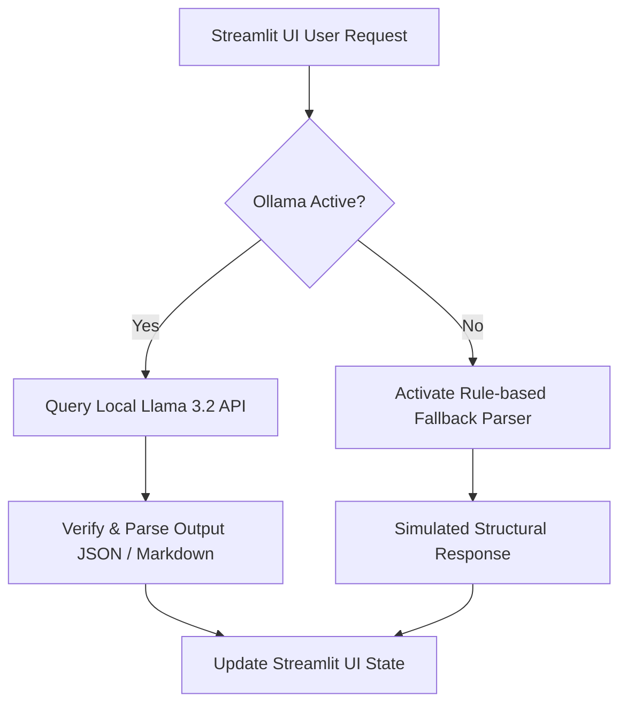

# Local Llama 3.2 Integration Guide - Construction Intelligence Hub

This document details the architecture, configuration, prompt designs, and implementation details for the local **Llama 3.2** model integration across the various modules of the Construction Intelligence Hub framework.

---

## 1. Integration Architecture & Workflow

The Construction Intelligence Hub utilizes **Ollama** as the local execution engine for running Llama 3.2. Ollama exposes a standard REST API locally on port `11434` which is queried by the Python standard backend using the official `ollama` library.

Below is a diagram illustrating the high-level workflow:



---

## 2. Integrated Modules Overview

Local LLM intelligence is integrated into three primary areas:

### Module A: Project Q&A & Building Code Desk (Tab 7)
- **Purpose**: Answer natural language queries concerning construction schedules, manager directories, budgets, active risks, weather disruptions, and safety incidents.
- **Scope Selection**: Supports focus scoping. Users can choose either the "Overall Portfolio" or select a specific project.
- **Context Injection**: Live application state data (from `st.session_state`) is automatically formatted into a structured text context block and injected directly into the LLM system prompt.
- **Llama 3.2 System Prompt Design**:
  ```text
  You are the Construction Intelligence Hub AI Assistant, a professional expert in construction management, safety audits, and project operations.
  You are given real-time live telemetry data from active projects under the 'Real-time Project Context' heading.
  Use this data to provide highly accurate, analytical, and professional answers to the user's queries.
  The user's query focus is currently set to: [Project Name / Overall Portfolio].
  If the user asks about specific budgets, metrics, risks, or safety incidents, refer directly to the live context.
  If the information is not present in the context, clearly explain that it is not currently logged, and answer their query using standard best practices in construction management.
  Keep responses professional, concise, and structured (using bold text and bullet points where helpful).
  ```

---

### Module B: Construction Document Analysor (Tab 3)
- **Purpose**: Automatically parse technical specifications, subcontractor contracts, and safety briefs.
- **Project Summarizer**: Compiles and audits the active telemetry, daily reports, safety logs, and active risks of a selected project.
- **Structured Output**: Instructs Llama 3.2 to enforce a structured JSON schema containing:
  1. `specifications`: A markdown summary of key specifications.
  2. `risks`: An array of flagged warnings, critical errors, or information notes.
  3. `checklist`: Actionable check items with boolean checkboxes for site verification.
- **Enforced JSON Prompt Design**:
  ```text
  Analyze the following construction document content and extract detailed information for three sections: key specifications, risks/anomalies, and compliance checklist.
  Return the output as a valid raw JSON object ONLY, with exactly three keys: 'specifications', 'risks', and 'checklist'. Do not wrap the JSON block in markdown backticks or any other text.
  ```

---

### Module C: Material Cost Estimator & Parameter Extractor (Tab 5)
- **Purpose**: Read technical design briefs or contract documents, extract structural dimensions, and compute material estimations.
- **Parameters Extracted**:
  - **Structure Topology** (Residential Apartment, Commercial Glass Tower, or Infrastructure Flyover)
  - **Plinth Area** (in square feet)
  - **Number of Floors**
  - **Slab Thickness** (in inches)
  - **Concrete Grade Standard** (M20, M25, M30, M40)
- **Estimation Math**: The extracted parameters are automatically loaded into civil engineering equations to calculate required volumes of Cement (bags), Steel (tons), Fine Sand (CFT), Coarse Aggregates (CFT), Bricks (units), and Paint (liters), calculating totals using Indian Rupee (₹) pricing.

---

## 3. Local Setup Instructions

To run Llama 3.2 locally on your machine for the Construction Intelligence Hub, complete the following steps:

1. **Install Ollama**:
   - Download the installer for your operating system from [ollama.com](https://ollama.com).
   - Install the software. The background service will spin up on: `http://localhost:11434`.

2. **Pull the Llama 3.2 Model**:
   - Open a command line interface (Terminal/PowerShell) and execute:
     ```bash
     ollama pull llama3.2
     ```
   - *Note*: If system resources are limited (less than 8GB RAM), you may pull the ultra-lightweight `phi3:mini` model instead:
     ```bash
     ollama pull phi3:mini
     ```

3. **Verify running status**:
   - Run `ollama list` in the command prompt to ensure `llama3.2` appears in the list of available models.
   - Start the Streamlit application; the sidebar indicator should display a green **🟢 Ready** badge.

---

## 4. Visual Interface & Screenshots

This section is reserved for UI visual check-offs.

#### Placeholder: Active Local LLM Connection (Sidebar Status)
*[Insert screenshot showing the active ready state under '🤖 Ollama Local LLM Settings' in the sidebar here]*
*(Suggested location: `assets/screenshot_ollama_sidebar.png`)*

<br>

#### Placeholder: Material Estimation Document Parser (Tab 5)
*[Insert screenshot showing parameters successfully extracted from the Commercial Glass Tower design brief here]*
*(Suggested location: `assets/screenshot_material_parser.png`)*

<br>

#### Placeholder: Q&A Focus Scope Selector (Tab 7)
*[Insert screenshot showing a user asking project-specific questions with a scoped project focus dropdown here]*
*(Suggested location: `assets/screenshot_qa_scoping.png`)*

---

## 5. Potential Challenges Faced & Solutions

During development and testing of the local Llama 3.2 integration, we identified the following challenges and resolved them:

### Challenge 1: Connection Latency on CPU-Only Workstations
* **Detail**: Without a dedicated NVIDIA GPU supporting CUDA, loading and querying a 3B parameter model like Llama 3.2 can take up to 10-20 seconds per response.
* **Solution**: 
  - Implemented an elegant Streamlit loading state spinner (`st.spinner`) to inform the user of ongoing operations.
  - Added a configuration box in the sidebar allowing developers to switch to smaller/faster models (e.g., `phi3` or `gemma2:2b`).
  - Implemented robust, highly responsive offline rule-based fallbacks so the application remains fully functional even without any local LLM service running.

### Challenge 2: JSON Parsing Errors from Model Hallucinations
* **Detail**: When requesting structured JSON for document analysis or parameter extraction, Llama 3.2 occasionally prepends conversational remarks (e.g., *"Here is the JSON you requested..."*) or wraps the JSON output in markdown code blocks (````json ... ````), causing native python `json.loads` to crash.
* **Solution**:
  - Implemented a regex cleaning function (`robust_json_extract_and_normalize`) that strips markdown code blocks and isolates the outermost curly braces `{ ... }`.
  - Added a secondary fallback regex-based keyword parser (`extract_material_params_fallback` and `parse_fallback_markdown`) that extracts key specifications, dimensions, and checklist items line-by-line if JSON decoding fails completely.

### Challenge 3: Loss of Chat History & Context on Reruns
* **Detail**: Streamlit's runtime model completely reruns the script upon any UI interaction. This resets standard variables and chat history, losing previous context.
* **Solution**:
  - Bound the chat messages history to `st.session_state.chat_messages`.
  - Stored model configuration variables in `st.session_state.ollama_model` and `st.session_state.ollama_ok` to persist status checks across tab switches.
